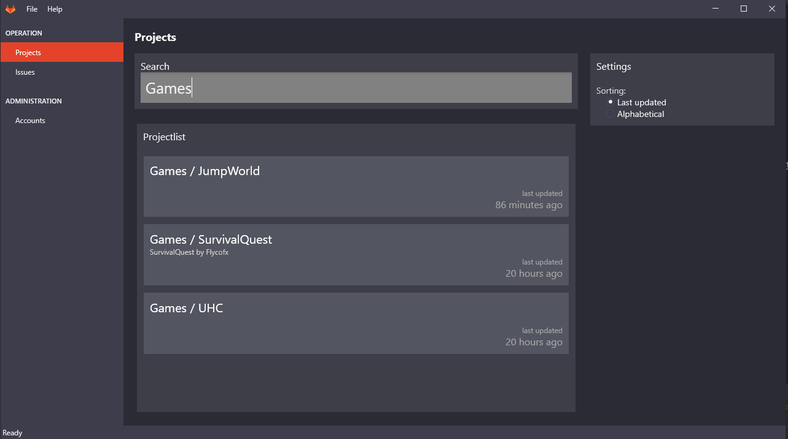
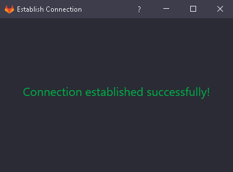

# GitlabManager

## Getting Started

1. Clone Project and Open it in Visual Studio / Rider
1. Run the Application
1. Create a personal access token in your gitlab instance 
   with `api`, `read_user` and `read_repository` scope (e.g. https://gitlab.com/-/profile/personal_access_tokens)
1. Go to "Accounts" inside the application and save a new account
1. You can test the connection with clicking "Test"
1. Go to projects to start downloading projects
1. Now you can search projects and doubleclick a project to see details
1. From the Detais-Page you can clone a project and open it in vs code or file explorer

## Screenshots

### Project List with Live-Search

### Account Management: Overview

### Account Management: Test connection

